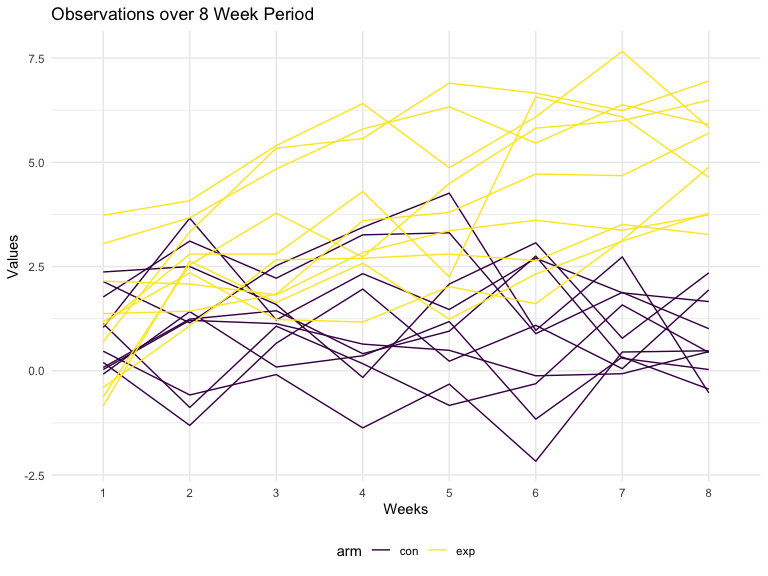
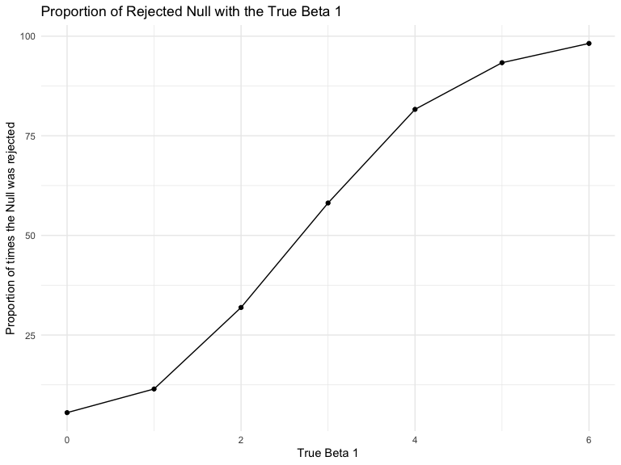
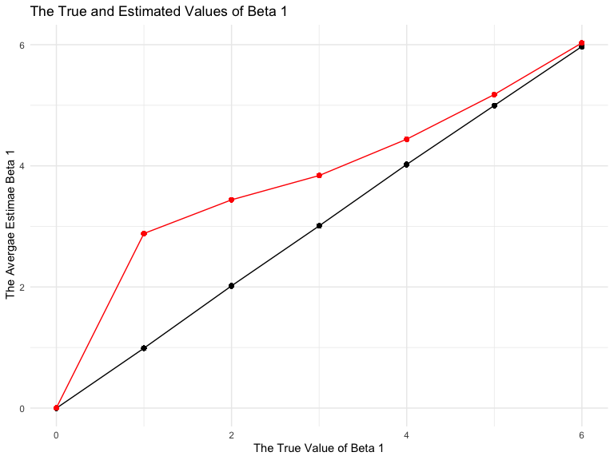

Homework\_5
================
Arielle
11/7/2019

``` r
library(tidyverse)

set.seed(10)

iris_with_missing = iris %>% 
  map_df(~replace(.x, sample(1:150, 20), NA)) %>%
  mutate(Species = as.character(Species))
```

Problem 1
---------

``` r
missing_values = function(x){
  if (is.numeric(x)) {
    (na_mean(x, option = "mean", maxgap = Inf)) }
    else if (is.character(x)) {
      (replace_na(x, "virginica"))}
}
```

``` r
output = map(iris_with_missing, missing_values)
```

Created a function that replaced the missing NAs that were numeric with the mean non-missing values. Also in that same function replaced the NAs in the character with virginica.

Problem 2
---------

Created and cleaned the data frame before making the the spaghetti plot that shows the differnece between the contron and the experimental arms.

``` r
df=
  tibble(observations = list.files(path = "data/", pattern = "csv", all.files = TRUE, full.names= TRUE)) %>% 
  mutate(df = map(observations, read_csv)) %>% 
  unnest()
```

    ## Parsed with column specification:
    ## cols(
    ##   week_1 = col_double(),
    ##   week_2 = col_double(),
    ##   week_3 = col_double(),
    ##   week_4 = col_double(),
    ##   week_5 = col_double(),
    ##   week_6 = col_double(),
    ##   week_7 = col_double(),
    ##   week_8 = col_double()
    ## )
    ## Parsed with column specification:
    ## cols(
    ##   week_1 = col_double(),
    ##   week_2 = col_double(),
    ##   week_3 = col_double(),
    ##   week_4 = col_double(),
    ##   week_5 = col_double(),
    ##   week_6 = col_double(),
    ##   week_7 = col_double(),
    ##   week_8 = col_double()
    ## )
    ## Parsed with column specification:
    ## cols(
    ##   week_1 = col_double(),
    ##   week_2 = col_double(),
    ##   week_3 = col_double(),
    ##   week_4 = col_double(),
    ##   week_5 = col_double(),
    ##   week_6 = col_double(),
    ##   week_7 = col_double(),
    ##   week_8 = col_double()
    ## )
    ## Parsed with column specification:
    ## cols(
    ##   week_1 = col_double(),
    ##   week_2 = col_double(),
    ##   week_3 = col_double(),
    ##   week_4 = col_double(),
    ##   week_5 = col_double(),
    ##   week_6 = col_double(),
    ##   week_7 = col_double(),
    ##   week_8 = col_double()
    ## )
    ## Parsed with column specification:
    ## cols(
    ##   week_1 = col_double(),
    ##   week_2 = col_double(),
    ##   week_3 = col_double(),
    ##   week_4 = col_double(),
    ##   week_5 = col_double(),
    ##   week_6 = col_double(),
    ##   week_7 = col_double(),
    ##   week_8 = col_double()
    ## )
    ## Parsed with column specification:
    ## cols(
    ##   week_1 = col_double(),
    ##   week_2 = col_double(),
    ##   week_3 = col_double(),
    ##   week_4 = col_double(),
    ##   week_5 = col_double(),
    ##   week_6 = col_double(),
    ##   week_7 = col_double(),
    ##   week_8 = col_double()
    ## )
    ## Parsed with column specification:
    ## cols(
    ##   week_1 = col_double(),
    ##   week_2 = col_double(),
    ##   week_3 = col_double(),
    ##   week_4 = col_double(),
    ##   week_5 = col_double(),
    ##   week_6 = col_double(),
    ##   week_7 = col_double(),
    ##   week_8 = col_double()
    ## )
    ## Parsed with column specification:
    ## cols(
    ##   week_1 = col_double(),
    ##   week_2 = col_double(),
    ##   week_3 = col_double(),
    ##   week_4 = col_double(),
    ##   week_5 = col_double(),
    ##   week_6 = col_double(),
    ##   week_7 = col_double(),
    ##   week_8 = col_double()
    ## )
    ## Parsed with column specification:
    ## cols(
    ##   week_1 = col_double(),
    ##   week_2 = col_double(),
    ##   week_3 = col_double(),
    ##   week_4 = col_double(),
    ##   week_5 = col_double(),
    ##   week_6 = col_double(),
    ##   week_7 = col_double(),
    ##   week_8 = col_double()
    ## )
    ## Parsed with column specification:
    ## cols(
    ##   week_1 = col_double(),
    ##   week_2 = col_double(),
    ##   week_3 = col_double(),
    ##   week_4 = col_double(),
    ##   week_5 = col_double(),
    ##   week_6 = col_double(),
    ##   week_7 = col_double(),
    ##   week_8 = col_double()
    ## )
    ## Parsed with column specification:
    ## cols(
    ##   week_1 = col_double(),
    ##   week_2 = col_double(),
    ##   week_3 = col_double(),
    ##   week_4 = col_double(),
    ##   week_5 = col_double(),
    ##   week_6 = col_double(),
    ##   week_7 = col_double(),
    ##   week_8 = col_double()
    ## )
    ## Parsed with column specification:
    ## cols(
    ##   week_1 = col_double(),
    ##   week_2 = col_double(),
    ##   week_3 = col_double(),
    ##   week_4 = col_double(),
    ##   week_5 = col_double(),
    ##   week_6 = col_double(),
    ##   week_7 = col_double(),
    ##   week_8 = col_double()
    ## )
    ## Parsed with column specification:
    ## cols(
    ##   week_1 = col_double(),
    ##   week_2 = col_double(),
    ##   week_3 = col_double(),
    ##   week_4 = col_double(),
    ##   week_5 = col_double(),
    ##   week_6 = col_double(),
    ##   week_7 = col_double(),
    ##   week_8 = col_double()
    ## )
    ## Parsed with column specification:
    ## cols(
    ##   week_1 = col_double(),
    ##   week_2 = col_double(),
    ##   week_3 = col_double(),
    ##   week_4 = col_double(),
    ##   week_5 = col_double(),
    ##   week_6 = col_double(),
    ##   week_7 = col_double(),
    ##   week_8 = col_double()
    ## )
    ## Parsed with column specification:
    ## cols(
    ##   week_1 = col_double(),
    ##   week_2 = col_double(),
    ##   week_3 = col_double(),
    ##   week_4 = col_double(),
    ##   week_5 = col_double(),
    ##   week_6 = col_double(),
    ##   week_7 = col_double(),
    ##   week_8 = col_double()
    ## )
    ## Parsed with column specification:
    ## cols(
    ##   week_1 = col_double(),
    ##   week_2 = col_double(),
    ##   week_3 = col_double(),
    ##   week_4 = col_double(),
    ##   week_5 = col_double(),
    ##   week_6 = col_double(),
    ##   week_7 = col_double(),
    ##   week_8 = col_double()
    ## )
    ## Parsed with column specification:
    ## cols(
    ##   week_1 = col_double(),
    ##   week_2 = col_double(),
    ##   week_3 = col_double(),
    ##   week_4 = col_double(),
    ##   week_5 = col_double(),
    ##   week_6 = col_double(),
    ##   week_7 = col_double(),
    ##   week_8 = col_double()
    ## )
    ## Parsed with column specification:
    ## cols(
    ##   week_1 = col_double(),
    ##   week_2 = col_double(),
    ##   week_3 = col_double(),
    ##   week_4 = col_double(),
    ##   week_5 = col_double(),
    ##   week_6 = col_double(),
    ##   week_7 = col_double(),
    ##   week_8 = col_double()
    ## )
    ## Parsed with column specification:
    ## cols(
    ##   week_1 = col_double(),
    ##   week_2 = col_double(),
    ##   week_3 = col_double(),
    ##   week_4 = col_double(),
    ##   week_5 = col_double(),
    ##   week_6 = col_double(),
    ##   week_7 = col_double(),
    ##   week_8 = col_double()
    ## )
    ## Parsed with column specification:
    ## cols(
    ##   week_1 = col_double(),
    ##   week_2 = col_double(),
    ##   week_3 = col_double(),
    ##   week_4 = col_double(),
    ##   week_5 = col_double(),
    ##   week_6 = col_double(),
    ##   week_7 = col_double(),
    ##   week_8 = col_double()
    ## )

``` r
df1=
df %>% 
  janitor::clean_names() %>%
  mutate(
    observations= str_remove(observations, "data//"),
    observations = str_remove(observations, ".csv")) 
```

``` r
df2 =
  df1%>% 
  mutate(observation = observations) %>% 
  separate(observations, into= c("arm", "subjectID"), sep = "_") %>%
  pivot_longer(
     week_1:week_8,
     names_prefix = "week_",
     names_to = "weeks",
     values_to = "value") 
```

### Spaghetti Plot

``` r
df2 %>%  
  group_by(subjectID, arm) %>% 
  ggplot(aes(x= weeks, y= value, group= observation, color = arm)) + geom_line() +labs(
    x = "Weeks",
    y = "Values",
    title= "Observations over 8 Week Period")
```



The experimental observations have an overall higher values than those in the controls.The experimentals increase over the eight week period, whereas the controls seem to slightly decreased over the same 8 week period.

Problem 3
---------

The code below is seeyong the sample size needed to make the plots for problem three. These were the following qualifications for the data set.

### \* Fix n=30

### *Fix xi1 as draws from a standard Normal distribution \#\#\#*Fix β0=2

### \*Fix σ2=50

Also generated the datasets of 10,000 for 6 different betas from 0-6 and used those sets to create the plots below.

``` r
set.seed (10)

sim_regression = function(n= 30, beta0 = 2, beta1 = 0) {
  
  sim_data = tibble(
    x = rnorm(n),
    y = beta0 + beta1 * x + rnorm(n, 0, sqrt(50))
  )
  
  ls_fit = lm(y ~ x, data = sim_data) %>% 
    broom::tidy()
  
  tibble(
    b1_estimate = ls_fit[[2,2]],
    p_value = ls_fit[[2,5]])
  
}

sim_regression
```

    ## function(n= 30, beta0 = 2, beta1 = 0) {
    ##   
    ##   sim_data = tibble(
    ##     x = rnorm(n),
    ##     y = beta0 + beta1 * x + rnorm(n, 0, sqrt(50))
    ##   )
    ##   
    ##   ls_fit = lm(y ~ x, data = sim_data) %>% 
    ##     broom::tidy()
    ##   
    ##   tibble(
    ##     b1_estimate = ls_fit[[2,2]],
    ##     p_value = ls_fit[[2,5]])
    ##   
    ## }

``` r
sim_results = 
  tibble ( 
    beta1 = c(0,1,2,3,4,5,6)) %>% 
  mutate (
    output_list = map(.x = beta1, ~rerun(10000, sim_regression(beta1 = .x))),
    output_df = map(output_list, bind_rows)) %>% 
  select (-output_list) %>% 
  unnest (output_df)
```

The plot below is showing the proportion of times that the null was rejected and the true beta 1 values.

### Plot 1

``` r
df_plot =
sim_results %>% 
  group_by(beta1) %>% 
  count(rejected = p_value < 0.05) %>% 
  mutate(proportion = n/sum(n)*100) %>% 
  filter(rejected == TRUE) 
```

``` r
df_plot %>%
  ggplot(aes(x = beta1, y = proportion)) + geom_point() + geom_line() + labs(x = "True Beta 1",
                   y = "Proportion of times the Null was rejected",
               title = "Proportion of Rejected Null with the True Beta 1")
```



The association between power and effect size is that as the effect size increaze power also needs to be increased.

The code below is showing the estimated and true values of the betas and the difference between them.

``` r
df_plot1=
  sim_results %>%
  group_by(beta1) %>% 
  mutate(mean_beta = mean(b1_estimate)) 
```

``` r
df_plot2 =
  sim_results %>% 
  group_by(beta1) %>% 
  filter(p_value < 0.05) %>% 
  mutate(mean_estimate = mean(b1_estimate))
```

### Plot 2 and 3

``` r
ggplot() + 
  geom_line(data = df_plot1, (aes(x = beta1, y = mean_beta))) +
  geom_line(data = df_plot2,(aes(x = beta1, y = mean_estimate)), color = "red") +
  geom_point(data = df_plot1, (aes(x = beta1, y = mean_beta))) +
  geom_point(data = df_plot2,(aes(x = beta1, y = mean_estimate)), color = "red")+ labs(
    x = "The True Value of Beta 1",
    y = " The Avergae Estimae Beta 1",
    title = "The True and Estimated Values of Beta 1"
  )
```



The sample avergae beta 1s when the beta 1 was 0 and when beta 1 was 6 were approxminately equal to the true value of beta 1. Otherwise the estimates were higher for 2,3,4,5 than the true value of the betas 1.As the betas increased the average betas were approaching the true value of beta one. Rejecting the null hypothesis is stating that there is a difference betweeen the true and estimated values, so it makes sense that the values would be appreciably different from each other.
